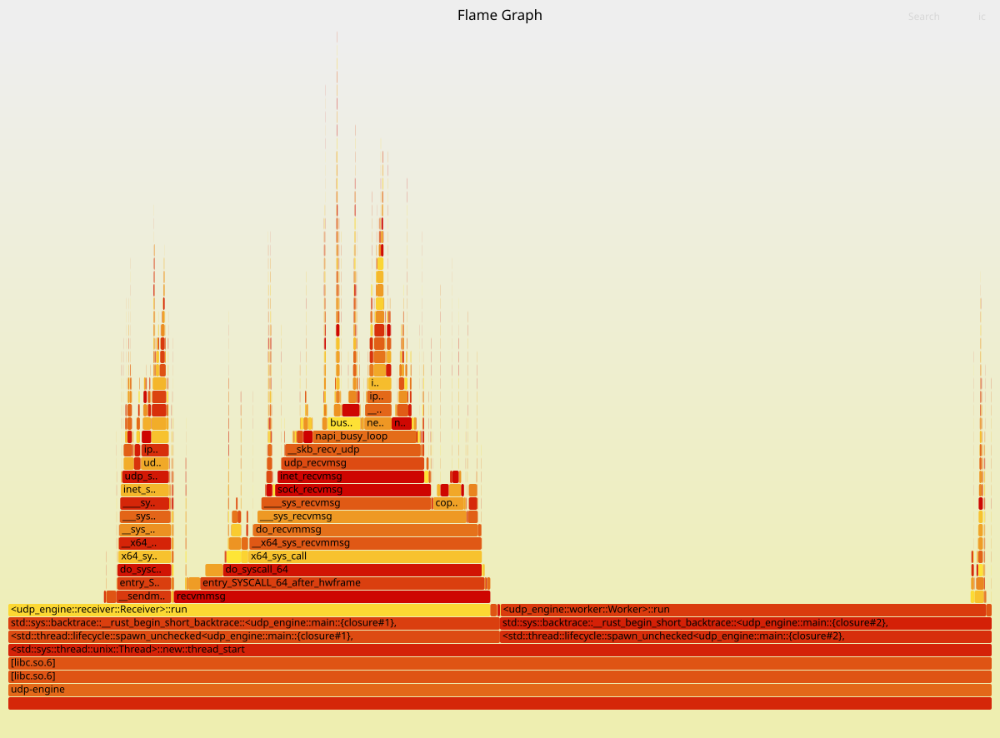

# High-Throughput Low-Latency UDP Engine (task #2)

UDP echo engine built around `SO_REUSEPORT`, batched syscalls (`recvmmsg` / `sendmmsg`), and a lock-free SPSC ring buffer. Each receiver/worker pair is pinned to dedicated cores. No shared socket, no mutexes, no heap allocations in the hot path.

## What & Why

Standard `Arc<UdpSocket>` creates kernel-level lock contention and one syscall per packet. This engine eliminates both: each thread owns a distinct socket, and packets are received/sent in batches of 64 via a single syscall. A lock-free ring buffer moves packets between receiver and worker threads without OS synchronization primitives.

## Architecture

Each receiver binds its own UDP socket with `SO_REUSEPORT`; the kernel distributes traffic by 4-tuple hash across independent per-thread socket queues. Received packets are pushed into a fixed-size, power-of-two SPSC ring buffer (`Acquire`/`Release` atomics) without any OS-level locks. The worker pops a packet, runs business logic (currently a straight echo), and pushes the reply back to the receiver for batched sending. The receiver then gathers outgoing packets and transmits them in batches via `sendmmsg`, keeping the syscall count minimal.

## Build

```bash
RUSTFLAGS="-C force-frame-pointers=yes" cargo build --release
```

Binaries:
- `./target/release/udp-engine`
- `./target/release/flood`

## Environment setup

```bash
sudo sysctl -w net.core.rmem_max=134217728
sudo sysctl -w net.core.rmem_default=67108864
sudo sysctl -w net.core.wmem_max=134217728
sudo sysctl -w net.core.wmem_default=67108864
sudo sysctl -w net.core.netdev_max_backlog=250000
sudo sysctl -w net.core.busy_read=50
sudo sysctl -w net.core.busy_poll=50
```

*OR*

```bash
chmod +x setup_env.sh
sudo ./setup_env.sh
```

## Run

Server (cores 0–3)
```bash
SERVER_ADDRESS=127.0.0.1:8080 taskset -c 0-3 ./target/release/udp-engine
```

> Or you can use any other `SERVER_ADDRESS`. You can run it without any `SERVER_ADDRESS` as well (default one will be used).

Load generator (cores 4–5)
```bash
taskset -c 4,5 ./target/release/flood
```

> Do not forget to change the hardcoded address value if it was changed.

The flood tool sends batches of 64 packets via `sendmmsg` and drains replies in a tight loop so the engine does not hit `EAGAIN` on the send side.

## Profiling

### FlameGraph

You can analyze the profiling data using either a GUI tool (`hotspot`) or Brendan Gregg's script-based SVG generator.

#### Option A: Script-based FlameGraph
Due to display server and Qt platform plugin limitations in WSL2 (`could not connect to display`), the script-based pipeline is used to generate an interactive SVG:

```bash
# 0. Clone FlameGraph if you don't have it yet
git clone https://github.com/brendangregg/FlameGraph.git

# 1. Record
sudo perf record -F 99 -g -p $(pgrep udp-engine) -o perf.data -- sleep 20

# 2. Export
sudo perf script -i perf.data > out.perf

# 3. Collapse + render
./FlameGraph/stackcollapse-perf.pl out.perf > out.folded
./FlameGraph/flamegraph.pl out.folded > flamegraph.svg
```

#### Option B: KDAB Hotspot (GUI Alternative)
If you are running on a native Linux environment with a working display server, you can open the recording directly in the graphical interface:

```bash
hotspot perf.data
```

*(Note: Had to use the script-based FlameGraph above because `hotspot` fails to initialize under Windows / WSL2 environment).*

### Hardware counters

```bash
sudo perf stat -e L1-dcache-load-misses,LLC-load-misses,cs -p $(pgrep udp-engine) -- sleep 30
```

> `LLC-load-misses` is `<not supported>` on WSL2 because the hypervisor does not expose last-level-cache PMU counters.

## Results

### Latency (WSL2 loopback, two active lanes)

| Percentile | Value |
|------------|-------|
| p50 | 5.91 – 1712.13 µs |
| p99 | 139.78 µs – 72.22 ms |
| p99.9 | 451.07 µs – 72.88 ms |
| max | 587.26 µs – 113.18 ms |

Spikes at p99+ are caused by WSL2 virtualization overhead (page faults, host scheduling). On bare metal these tails are significantly lower.

### Throughput

Both receiver/worker lanes are active in this run.

| Lane | Total recv | Total sent | Processed | Dropped |
|------|------------|------------|-----------|---------|
| rx0 / wx1 | 1 985 049 | 1 985 049 | 2 012 835 | 0 |
| rx2 / wx3 | 2 085 664 | 2 085 660 | 2 102 623 | 0 |

These totals are aggregates over the full engine run (≈35–40 s). Per-interval receive rates observed in the log vary between ~39 000–52 000 for rx0 and ~38 000–53 000 for rx2. On a physical NIC with diverse UDP flows both lanes scale independently and the aggregate PPS grows nearly linearly with the number of lanes.

### `perf stat` (30 s)

| Counter | 30 s total | Per second |
|---------|------------|------------|
| L1-dcache-load-misses | 2 487 858 379 | ~82.9 M |
| context-switches | 9 928 | ~331 |
| LLC-load-misses | `<not supported>` | — |

### Drop counters (from engine log)

| Type | Count | Note |
|------|-------|------|
| `dropped(ring full)` | 0 | Worker keeps up |
| `dropped(send full)` | 0 | Flood drains replies |

### FlameGraph



The receiver threads dominate the profile (left), spending nearly all time inside `recvmmsg` → `udp_recvmsg` and `sendmmsg` → `udp_sendmsg`. The workers (right) remain thin strips — they do not bottleneck the pipeline.

## Known Limitations

- **WSL2:** No LLC counters; absolute PPS/latency are bounded by the VM's virtualized network stack.
- **Loopback hash distribution:** `SO_REUSEPORT` on `127.0.0.1` now distributes across both sockets because the flood generator uses distinct 4-tuples, but the exact split remains subject to the kernel's hashing policy.
- **Ceiling:** To reach 5–10 M PPS the engine must run on bare metal with a physical 10 GbE+ NIC and multiple diverse UDP flows.

## Files

- `flamegraph.svg` — FlameGraph
- `perf_stat_report.txt` — raw `perf stat` output
- `run_results.txt` — engine stdout with per-second metrics
