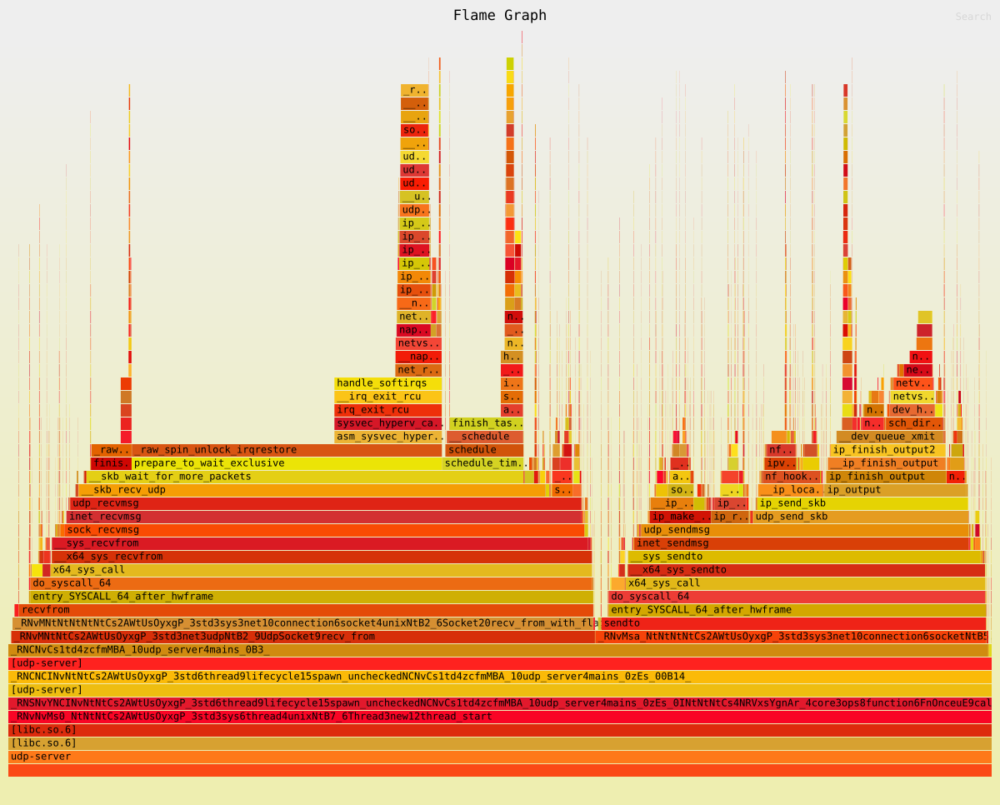
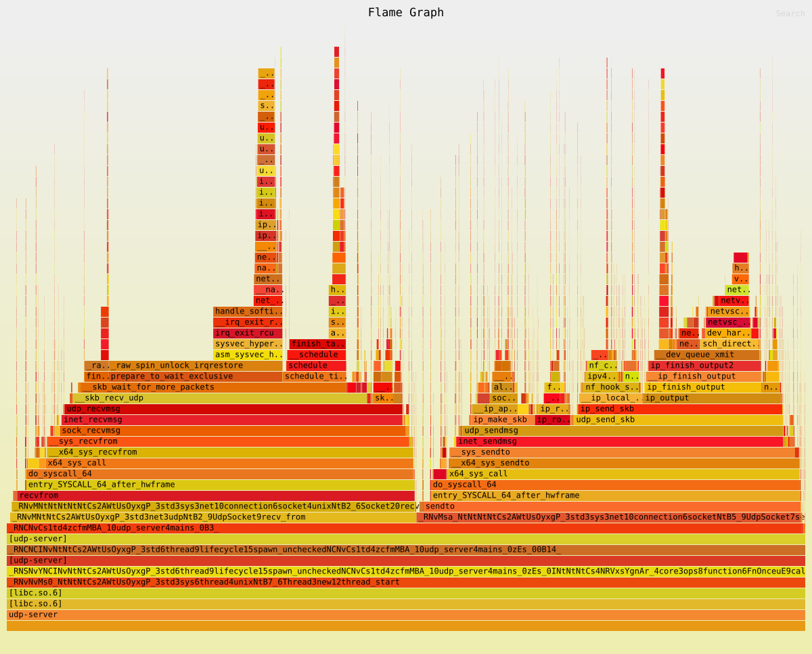

# Simple UDP Server (task #1)

High-load multi-threaded UDP server in Rust with CPU pinning optimization via `taskset` and performance profiling using `perf` + FlameGraph.

The server spawns `N` worker threads (where `N` equals the number of available CPU cores), all sharing a single `UdpSocket` via `Arc`. Each thread runs an echo loop: `recv_from` → `send_to` back to the sender.

## Build

To build the project use this command below:

```bash
RUSTFLAGS="-C force-frame-pointers=yes" cargo build --release
```

The binary will be at `./target/release/udp-server`.

## Run

### Without CPU pinning (baseline)

```bash
./target/release/udp-server
```

By the way, the server listens on `127.0.0.1:8080` by default. To change the address:
```bash
SERVER_ADDRESS=0.0.0.0:6000 ./target/release/udp-server
```

### With CPU pinning (optimized)

```bash
taskset -c 0,1,2,3 ./target/release/udp-server
```

## Load generation

You can use `hping3` to generate UDP flood traffic:

```bash
sudo hping3 --udp -p 8080 --flood --data 100 127.0.0.1
```

Just an example, any other load generator can be used.

## Profiling

> **Prerequisite:** To generate SVGs, ensure you have `inferno` installed:  
> `cargo install inferno`

### FlameGraph (before vs after)

```bash
# 1. Start the server (choose baseline or optimized)
# 2. Start flood traffic
# 3. Record profile for 20 seconds (specify output file name)
sudo perf record -e cpu-clock -g -p $(pgrep -x udp-server) -o perf_after.data -- sleep 20

# Generate SVG
# This example generates SVG for the optimized run
sudo perf script -i perf_after.data | inferno-collapse-perf | inferno-flamegraph > flame_after.svg
```

> **Note:** Remember to change the input/output filenames when generating the baseline graph.

### `perf stat` comparison

```bash
sudo perf stat -p $(pgrep -x udp-server) -- sleep 10
```

Run this for both **without** and **with** `taskset`, then compare the numbers.

> **Troubleshooting:** If `perf` fails with `Failed to collect 'cycles:P'`, run:
> ```bash
> sudo sysctl kernel.perf_event_paranoid=1
> ```
> This is common in VMs or containers where hardware PMU counters are unavailable.

## Results

| Metric | Without `taskset` | With `taskset` | Change |
|--------|-------------------|----------------|--------|
| cpu-migrations/sec | 5,883 | 342 | **-94%** |
| IPC (insn per cycle) | 0.38 | 0.50 | **+31%** |
| Total cycles | 59.4B | 51.1B | **-14%** |
| context-switches/sec | 27.6K | 31.8K | +15%* |

\* A slight increase in context-switches is expected due to kernel socket contention from the shared `Arc<UdpSocket>` — the threads now compete on the same pinned cores instead of being scattered across the system.

## Visual Comparison

### Before optimization


### After optimization


## Conclusion

Binding threads to isolated CPU cores with `taskset` significantly reduced CPU migrations (-94%) and improved instruction throughput (+31% IPC).
The remaining context-switch overhead comes from the single shared UDP socket (`Arc<UdpSocket>`), which is acceptable for Task 1.

## Files

- `flame_before.svg` — FlameGraph without `taskset`
- `flame_after.svg` — FlameGraph with `taskset`
- Raw `perf` recordings (`perf_before.data`, `perf_after.data`) are generated locally and excluded from the repository due to size.
